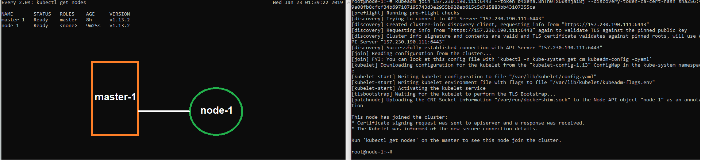
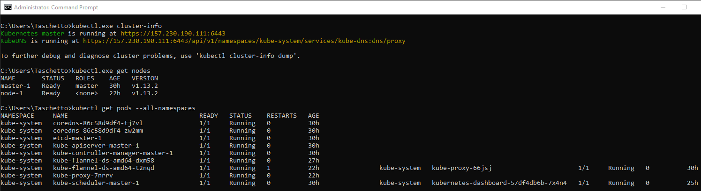
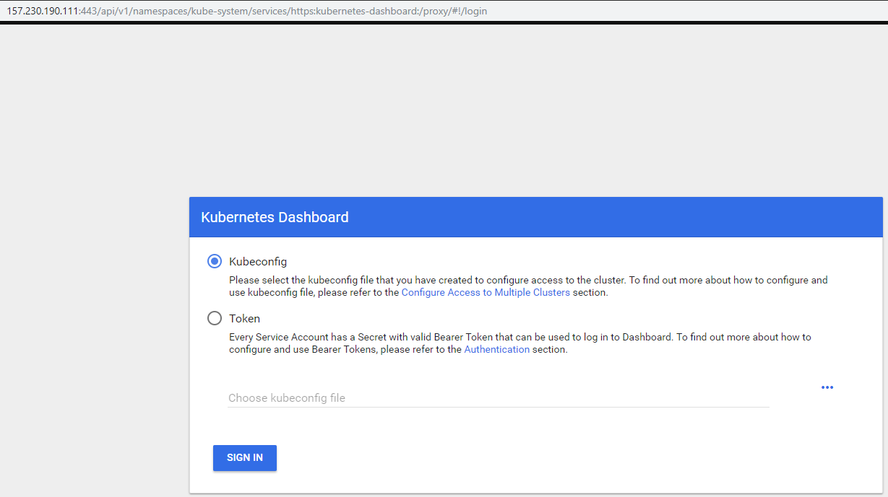
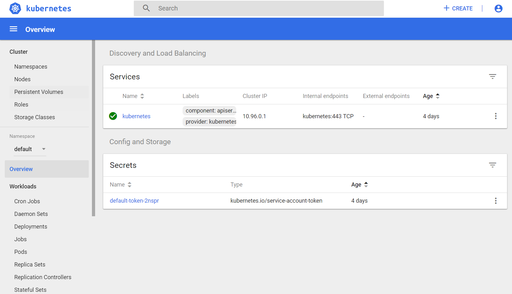
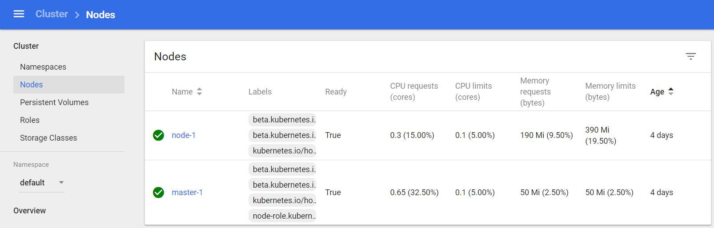

# Kubernetes DO Configuration

Repository containing some theory about Kubernetes and how to set up a master and a node using it on the Digital Ocean infrastructure provider. All these steps may change as the time goes by, so have in mind that these steps were executed by [me](https://www.linkedin.com/in/levindo) in January 2019.

*“Any sufficiently advanced technology is indistinguishable from magic." - A.C. Clarke*

**Author:** Levindo Gabriel Taschetto Neto.

## Theory
TO DO.

## Set Up a Master
Follow the steps on the [Master Config](master-config.sh) on the Master droplet.

TO DO: Put more details.

## Set Up a Node
Follow the steps on the [Node Config](node-config.sh) on the Node droplet.

TO DO: Put more details.

## Result



## How to Access the Cluster from a Local Machine
### On Windows 10

#### Install Kubernetes CLI (via Chocolatey Package Manager)

1.  Install Chocolatey
  1.  Open the *cmd* as an administrator.
  2.  Execute the following command:
```
@"%SystemRoot%\System32\WindowsPowerShell\v1.0\powershell.exe" -NoProfile -InputFormat None -ExecutionPolicy Bypass -Command "iex ((New-Object System.Net.WebClient).DownloadString('https://chocolatey.org/install.ps1'))" && SET "PATH=%PATH%;%ALLUSERSPROFILE%\chocolatey\bin"
```

2. On the same *cmd*, run:
```
$ choco install kubernetes-cli
```

#### Get the Settings from the Master
1. Go to the Master
2. Run the following commands to see if you've got what it takes!:
```
$ cd /etc/kubernetes
$ cat kubelet.conf
```
3. Go to the local machine, and run for obtaining the config file from the master node:
```
$ cd %HOMEPATH%
$ scp root@<IP_MACHINE_HERE>:/etc/kubernetes/admin.conf .
```

4. Get the master configuration to the a specific folder:
```
$ mkdir .kube
$ move admin.conf .kube
$ cd .kube
$ ren admin.conf config
$ del admin.conf
```

5. Try it out with some commands:
```
$ kubectl get nodes
$ kubectl get pods --all-namespaces
$ kubectl cluster-info
```
You must get something like this:



## Install and run the Dashboard
1.  Donwload the Dashboard (Link updated in 01/2019)

This action may be performed from your local machine if you have already configured *kubectl* and the *config* from master on it.
More details can be accessed on the section *How to Access the Cluster from a Local Machine** a little bit up in this readme :)
```
$ kubectl create -f dashboard/dash-admin-token.yaml --namespace=kube-system
```

2.  Go to the **master**, and run the following command:
```
$ kubectl -n kube-system describe secret $(kubectl -n kube-system get secret | grep admin-user | awk '{print $1}')
```

You're gonna get something similar to this:
```
Name:         admin-user-token-q79hm
Namespace:    kube-system
Labels:       <none>
Annotations:  kubernetes.io/service-account.name: admin-user
              kubernetes.io/service-account.uid: uid_here

Type:  kubernetes.io/service-account-token

Data
====
namespace:  11 bytes
token:      TOKEN_HERE
ca.crt:     1025 bytes
```

Copy everything in **TOKEN_HERE**.

3.  Init the proxy
```
$ kubectl proxy
```

4.  Go to [this link](http://localhost:8001/api/v1/namespaces/kube-system/services/https:kubernetes-dashboard:/proxy/#!/login).

## How to Use the Dashboard

1.  Access the dashboard on [http://localhost:8001/api/v1/namespaces/kube-system/services/https:kubernetes-dashboard:/proxy/#!/login](http://localhost:8001/api/v1/namespaces/kube-system/services/https:kubernetes-dashboard:/proxy/#!/login). Then, the following page must show up on your browser:



2.  Choose the option *Token*, paste *TOKEN_HERE* into the input box and click the button *Sign In*.

3.  The dashboard may then show up as follows:



4.  We can also verify our created master-1 and node-1 by going to the Nodes page:



## License

MIT License. Click [here](LICENSE.md) for more information about this license.
