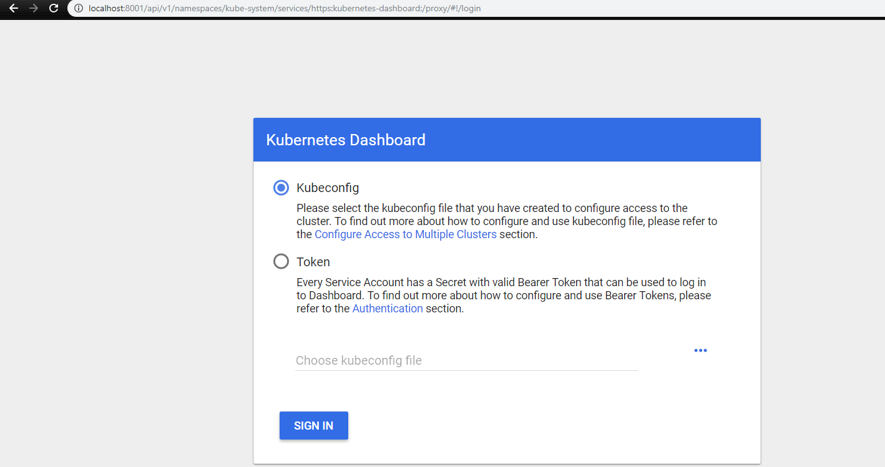

# Kubernetes DO Configuration

Repository containing some theory about Kubernetes and how to set up a master and a node using it on the Digital Ocean infrastructure provider. All these steps may change as the time goes by, so have in mind that these steps were executed by [me](https://www.linkedin.com/in/levindo) in January 2019.

**Author:** Levindo Gabriel Taschetto Neto.

## Theory
TO DO.

## Set Up a Master
Follow the steps on the [Master Config](master-config.sh) on the Master droplet.

TO DO: Put more details.

## Set Up a Node
Follow the steps on the [Node Config](node-config.sh) on the Node droplet.

TO DO: Put more details.

## Result


## How to Access the Cluster from a Local Machine
### On Windows 10

#### Install Kubernetes CLI (via Chocolatey Package Manager)

1.  Install Chocolatey
  1.  Open the *cmd* as an administrator.
  2.  Execute the following command:
```
@"%SystemRoot%\System32\WindowsPowerShell\v1.0\powershell.exe" -NoProfile -InputFormat None -ExecutionPolicy Bypass -Command "iex ((New-Object System.Net.WebClient).DownloadString('https://chocolatey.org/install.ps1'))" && SET "PATH=%PATH%;%ALLUSERSPROFILE%\chocolatey\bin"
```

2. On the same *cmd*, run:
```
choco install kubernetes-cli
```

#### Get the Settings from the Master
1. Go to the Master
2. Run the following commands to see if you've got what it takes!:
```
cd /etc/kubernetes
cat kubelet.conf
```
3. Go to the local machine, and run for obtaining the config file from the master node:
```
scp root@<IP_MACHINE_HERE>:/etc/kubernetes/kubelet.conf .
```

4. Get the master configuration to the a specific folder:
```
cd %HOMEPATH%
mkdir .kube
move kubelet.conf .kube
del kubelet.conf
```

5. Try it out with some commands:
```
kubectl get nodes
kubectl get pods --all-namespaces
kubectl cluster-info
```
You must get something like this:


## Install and run the Dashboard
1.  Donwload the Dashboard (Link updated in 01/2019)
```
kubectl create -f https://raw.githubusercontent.com/kubernetes/dashboard/master/aio/deploy/recommended/kubernetes-dashboard.yaml --namespace=kube-system
```

2.  Set it up
```
vi dashboard-admin.yaml
```
Copy the content from [dashboard-admin.yaml](dashboard/dashboard-admin.yaml) and paste it in the created file.

```
kubectl create -f dashboard-admin.yaml --validate=false
```

3.  For getting the Kubernetes proxy command to run in the background:
```
nohup kubectl proxy --address="157.230.190.111" -p 443 --accept-hosts='^*$' &
```

4.  This error may appear if you have not configured properly the dashboard-admin file:
```json
{
  "kind": "Status",
  "apiVersion": "v1",
  "metadata": {

  },
  "status": "Failure",
  "message": "forbidden: User \"system:node:master-1\" cannot get path \"/\"",
  "reason": "Forbidden",
  "details": {

  },
  "code": 403
}
```

## How to Use the Dashboard

1.  Access the dashboard on [http://157.230.190.111:443/api/v1/namespaces/kube-system/services/https:kubernetes-dashboard:/proxy/#!/login](http://157.230.190.111:443/api/v1/namespaces/kube-system/services/https:kubernetes-dashboard:/proxy/#!/login). Then, the following page must show up on your browser:



## License

MIT License. Click [here](LICENSE.md) for more information about this license.
